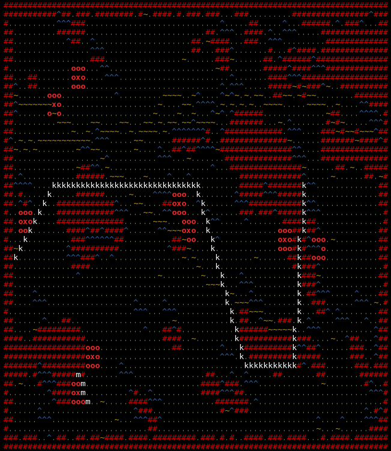
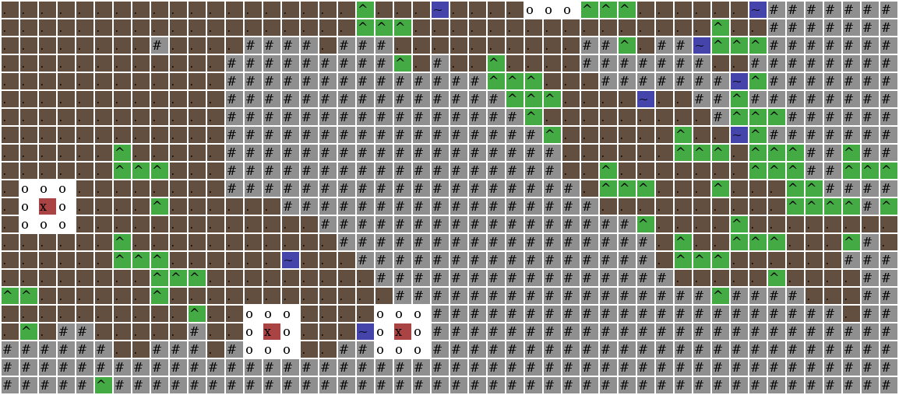

# ASCII Map

This tool produces randomly-generated roguelike ASCII maps with reasonably natural looking, connected landscapes which can be used in games of all sorts.

These are the different landscape elements:

```
#   stone
.   floor
~   water
^   tree
x   secret (treasure, place of interest, etc.)
o   protective walls around secrets
```

There is the option to draw straight polyline (`k`) and more Bresenham lines (`m`) which can be used to draw structures like streets, buildings, borders etc.

Water (`~`) forms both smaller ponds/lakes and lakes.

Trees (`^`) occur in patches (forests) as well as in single formations.

## Usage

```
$ ./run
```

... generates a random landscape and displays it:



```
$ ./animate
```
... generates and displays several landscapes in succession. This is useful to tweak parameters and get a feel for their effects:


*Note: Here, the white characters are randomly generated Bresenham lines (`m`) and a fixed polyline (`k`).*

## HTML Export

There is also the option to render maps to HTML:



An example file is included: `index.html`.

## Colors

Colors can be customized in `string_colors.rb`.
